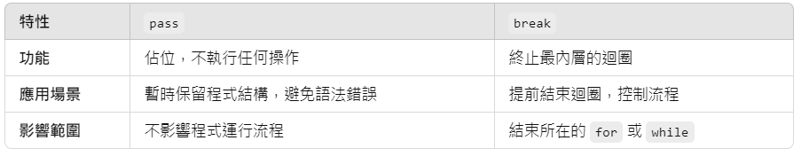
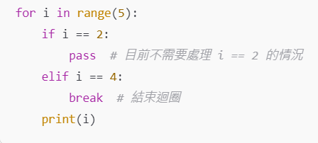

# 主題
## python 基礎練習

# 目的
## 認識並熟悉各python函數，銜接高階課程。

# 內容
## 1.倒印數列
``` python
data = input() .split()

n = int (data[0])

numbers = list(map(int, data))

numbers . reverse()

print(' '.join(map(str, numbers)))
```
Input():從輸入中讀取一行文字,讀取為字串。

“5 4 3 2 1 0 ” 

Split(): 將字串按照空格（或指定分隔符）切割成一個列表中的單獨項目。

“5 4 3 2 1 0” -→’5’,’4’,’3’,’2’,’1’,’0’ 

Int(): 將字串轉換為整數型別

‘5’-→5

Print():輸出給使用者
## 2.找最大值及索引
``` python   
x = input().split()

number = list(map(int, x))

max = max (number )

max_index = number . index(max)

print(max, max_index)
```
map(): 將一個函數應用到可迭代對象（如列表、元組）的每個元素上， 將 int() 應用到列表的每個元素上，將字串轉為整數

['4', '3', '2', '1', '0']-->[4, 3, 2, 1, 0] 

list(): 將可迭代對象轉換為列表。 

.reverse:列表元素反轉

[4, 3, 2, 1, 0] --> [0, 1, 2, 3, 4] 

「 」.join(): 用字串（如空格）連接可迭代對象中的元素，生成一個新的字串、方便輸出 

.join(map(str, numbers) --> 先用 map(str, numbers) 將整數列表 [0, 1, 2, 3, 4] 轉為字串列表 ['0', '1', '2', '3', '4']

再用 ' '.join() 將它們拼接成字串 "0 1 2 3 4"。
## 3.向量內積
```python

data = input().split()

number = list(map(int, data))

x = number [0]

y = number [1:x+1]

Z = number [x+1: ]

sum = sum(y[i]*z[i] for i in range(x))

print(sum)
```
Max():找出列表中的最大值

5 7 9 4 1-→9

.index():索引第一次出現的位置

.index(5)-->5 7 5 8 9-->1
## 4.矩陣轉置
```python
matrix = [list(map(int, input().split())) for _in range(5)]

transposed_matrix = [[matrix[j] [i] for j in range(5)] for i in range(5)]

for row in transposed_matrix:

print(" ". join(f"{num: 2d}" for num in row))
```
For in range(a, b+1):等同C語言的for(;a<b;a++)

For x in range(1, 5)--->x從1~4

Sum():將列表元組中數值加總
## 5.數列兩兩對調
```python

numbers = list(map(int, input(). split()))

try:
    while True:
        m, n = map(int, input().split())

    if m < 1 or m > 5 or n < 1 or n > 5:
        break

    numbers[m-1], numbers[n-1] = numbers[n-1], numbers [m-1]

except EOFError:
    pass

print(" " +" ".join(map(str, numbers)))
```
### try(), except(): 放置可能引發異常的程式碼 , except 可捕捉異常情形
```python
try: x = int(input("輸入一個數字: ")) 

result = 10 / x

except ValueError:

print("請輸入有效的整數！") 
```
### pass vs break



## 6.字串大小寫個數
```python
x = input ()

up = 0

low = 0

for char in x:

if char .isupper( ) :

    up=up+1

if char. islower():

    low=low+1

print(f"Up = {up}, Low = {low}")
```
.isupper():計算大寫數

.islower():計算小寫數
## 7.印字串及其長度
```python
x = input ()

Strlen = len(x)

print(f"STR = {x}, LEN = {Strlen}")
```
len():len():計算字符串、列表、元組、字典、集合等的長度

lst = [1, 2, 3, 4, 5] len(lst)-->5
## 8.印三角形函數
```python
x, y = input ()

x= int (x)

for z in range(1, x+1):

print(f"{y}"*z)
```
## 9.字串串接
```python
password = input() .strip()

while True:

try:

    line = input().strip()

    num, word = line. split()

    num = int (num)

    if num == 0:

        password = word + password

    elif num == 1:

        password = password + word

    else :

        break

except EOFError:

    break

print (password)
```
.Strip():移除首尾空白, .strip(#):移除首尾#

.lstrip(): 移除左側空白

.rstrip(): 移除右側空白

EOFerror:檔尾錯誤
## 10.3n+1
```python

def f(n):

    count = 1

    while n != 1:

        if n%2 == 0:

            n/=2

        else:

            n=3*n+1

    count+=1

return count

a, b = input().split()

n = int(a)

l = int (b)

if n>l:

    n, l = l, n

max = f(n)

for c in range(n+1, l+1):

    p = f(c)

    if f(c)>max:

        max = p

print(f"{n} {l} {max}")
```
n, l = l, n可交換兩數附值

# 心得
雖說C語言和python為兩相近的語言，但我在練習時仍碰到不少阻礙，首先麻煩的就是千奇百怪的函式，從簡單的加總sum()、max()，到list(map(int, n))，
最後一層一層的包裹起來，就變得很複雜。該說python是簡單易懂的程式語言嗎，我不這麼認為，因為追求直觀的結果就是要記憶的東西很多，並且越是淺顯的
東西要表達出一樣的意思就必須要包裹更多層。
所以我也使用了AI來幫助寫程式，並嘗試去理解弄懂它，我還有很多知識盲區，希望以後能參加python的選修課來精進自己。


    